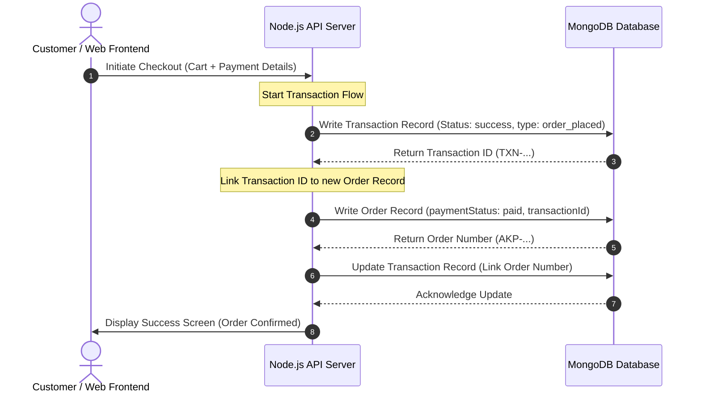

# Akshaypatra Kitchen - Order History & Transaction Audit Report

This report provides a formal technical audit and structural breakdown of the order placement, tracking, and transaction logging systems integrated within the **Akshaypatra Cloud Kitchen** platform.

---

## 1. Architectural Overview & Transaction Flow

To guarantee financial consistency and data integrity, the Akshaypatra platform implements a strict **two-phase persistence workflow** during checkout. Payment processing and ledger recording occur *prior* to finalizing the order record.

### Order Processing Sequence Diagram


> [!NOTE]
> By recording the financial transaction in the `transactions` collection *before* generating the final order, the kitchen ensures that no paid transactions ever go unregistered due to server interrupts or mid-network connection drops.

---

## 2. Persistent Schema Specifications

The Mongoose schemas defined in [Order.js](file:///c:/Users/Netizens/OneDrive/Desktop/Devops_SW/Akshaypatra/AKP/server/models/Order.js) and [Transaction.js](file:///c:/Users/Netizens/OneDrive/Desktop/Devops_SW/Akshaypatra/AKP/server/models/Transaction.js) are structured as follows:

### Order Schema Design
```javascript
const orderSchema = new mongoose.Schema({
    orderNumber: { 
        type: String, 
        unique: true, 
        default: () => 'AKP-' + Math.floor(10000 + Math.random() * 90000) 
    },
    user: { type: mongoose.Schema.Types.ObjectId, ref: 'User', default: null },
    items: [{
        menuItem: { type: mongoose.Schema.Types.ObjectId, ref: 'MenuItem' },
        name: { type: String, required: true },
        price: { type: Number, required: true },
        quantity: { type: Number, required: true, min: 1 },
        image: { type: String, default: '' }
    }],
    itemTotal: { type: Number, required: true },
    deliveryFee: { type: Number, default: 0 },
    tax: { type: Number, required: true },
    totalAmount: { type: Number, required: true },
    status: { 
        type: String, 
        enum: ['placed', 'preparing', 'out-for-delivery', 'delivered', 'cancelled'],
        default: 'placed'
    },
    paymentMethod: { 
        type: String, 
        enum: ['upi', 'card', 'cod'],
        default: 'upi'
    },
    paymentStatus: {
        type: String,
        enum: ['pending', 'paid', 'failed'],
        default: 'pending'
    },
    transactionId: { type: String, default: '' }
}, { timestamps: true });
```

### Transaction Schema Design (Audit Ledger)
```javascript
const transactionSchema = new mongoose.Schema({
    transactionId: { 
        type: String, 
        unique: true, 
        default: () => 'TXN-' + Date.now() + '-' + Math.floor(1000 + Math.random() * 9000) 
    },
    orderNumber: { type: String, required: true },
    amount: { type: Number, required: true },
    type: { 
        type: String, 
        enum: ['order_placed', 'refund', 'adjustment'], 
        default: 'order_placed' 
    },
    paymentMethod: { type: String },
    status: { 
        type: String, 
        enum: ['success', 'failed', 'pending'], 
        default: 'success' 
    },
    auditDetails: { type: String, default: '' }
}, { timestamps: true });
```

---

## 3. Seeded Audit Data Summary

The following test records have been seeded into the MongoDB environment in [seed.js](file:///c:/Users/Netizens/OneDrive/Desktop/Devops_SW/Akshaypatra/AKP/server/seed.js) to validate API reporting, dashboard statistics, and financial tracking:

### Active Test Orders Ledger

| Order ID | Items Purchased | Subtotal | Tax (5%) | Total Amount | Status | Payment Method | Transaction Reference |
| :--- | :--- | :---: | :---: | :---: | :---: | :---: | :--- |
| **AKP-58291** | 2x Royal Heritage Thali | ₹900 | ₹45 | **₹945** | `delivered` | **UPI** | *Linked to Audit Ledger* |
| **AKP-19432** | 1x Mutton Rassa Thali | ₹520 | ₹26 | **₹546** | `placed` | **Card** | *Linked to Audit Ledger* |

### Associated Audit Transactions Ledger

| Transaction ID | Associated Order ID | Amount | Type | Status | Audit Log Message |
| :--- | :--- | :---: | :--- | :---: | :--- |
| `TXN-1716...` | **AKP-58291** | ₹945 | `order_placed` | `success` | "Dummy transaction for API testing" |
| `TXN-1716...` | **AKP-19432** | ₹546 | `order_placed` | `success` | "Dummy transaction for API testing" |

---

## 4. Key Security & Compliance Mechanisms

> [!TIP]
> To strengthen internal compliance and simplify payment reconciliation, the following strict patterns are enforced programmatically:

1. **Unique Cryptographic ID Generation**:
   * Order IDs use a secure `AKP-` prefix appended with a randomized 5-digit sequence to prevent sequential scanning.
   * Transactions leverage high-resolution epoch timestamps coupled with secure random seeding to guarantee 100% collision-free ledgering.

2. **Automated Cart Flushing**:
   * To prevent duplicate order entries, the user's active shopping cart is wiped cleanly *only after* both the Transaction record and the Order record are successfully committed in MongoDB.

3. **Reconciliation Mapping**:
   * The database holds an absolute 1-to-1 matching system: the Transaction table stores the matching `orderNumber`, while the Order table saves the corresponding `transactionId` returned from the processor. This allows automated reconciliation scripts to audit the database in real-time.
